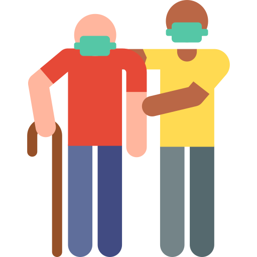
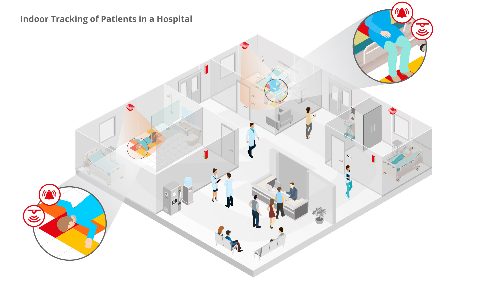

# Geriatrics - Extending an Electronic Arm!

<!-- PROJECT LOGO -->
<br />
<p align="center">
    


  <p align="center">
    Vision models to help the elderly.
    <br />
  </p>
</p>

<!-- TABLE OF CONTENTS -->
## Table of Contents

* [About the Project](#about-the-project)
* [Setup](#setup)
  * [Fall Detection Model](#fall-detection-model)
  * [Model to Detect if an Elderly got out of Bed](#model-to-detect-if-an-elderly-got-out-of-bed)
* [Videos](#videos)
* [Eventual Impact](#eventual-impact)

## About The Project

Most of the senior citizens are more prone to to falls. Also, their health deteriorates rapidly after a fall and in some cases, it can even lead to deaths. So, the elderly population is definitely one section of the society which requires constant supervision. Also, under the current unprecedented circumstances, it is difficult for the staff of various medical centres to constantly monitor the patients. 
Hence, to provide a solution to the above problems, these are the computer vision models developed for the care and well being of elderly people. 
The two computer vision models are:	
* #### Fall Detection :
    Model to detect if a person fell down. This would help not only the senior citizens in the hospital, but also anyone who falls down when he/she is alone and needs immediate healthcare assistance. 
* #### To Detect if a Person got out of his/her bed :
    To detect if an elderly patient got out of his/her bed. This could notify the support staff of such an event, so that the patient could get immediate support.
    
 <p align="center">
    
 </p>

<!-- GETTING STARTED -->
## Setup

* ### Fall Detection Model
    * #### Prerequisites for Fall Detection Model
        When in the Geriatrics directory,
        Enter the following line into the terminal -
        ```
            pip install requirements.txt
        ```
    * #### Steps to Train Fall Detection Model
        * #### Setting Up Requirements for Fall Detection Model
            When in the Geriatrics_Part1 directory,
            Enter the following line into the terminal -
            ```
                pip install requirements.txt
            ```
        * #### Extracting Images from the Videos
            When in the Geriatrics_Part1 directory, create a folder called Images and two subfolders called 'test' and 'train' inside it. Inside each one of these create 'Fall' and 'Regular_Activity' folders. Create a file named datafile.csv.
        Enter the following line into the terminal -
        ```
            python extract_files.py mp4
        ```
        * #### Training Fall Detection Model
            When in the Geriatrics_Part1 directory,
            Enter the following line into the terminal -
            ```
                python train.py 50 2 480 640
            ```
    * #### Steps to Run Fall Detection Model
        * #### Run the Fall Detection Model
            Open terminal in the GeriatricsPart1 directory.
            Enter the following line into the terminal -
            ```
                python rt_classification.py 50 2 480 640 <model_name> <video_name>
                Example: python rt_classification.py 50 2 'model_021_0.289_0.384.hdf5' 'Videos/test/Fall/cam206.mp4'
            ```
* ### Model to Detect if an Elderly got out of Bed
    * #### Prerequisites for the Model
        When in the Geriatrics_Part2 directory,
        Enter the following line into the terminal -
        ```
            pip install requirements.txt
        ```
    * #### Steps to Train the Model
        * #### Setting Up Requirements for the Model
            When in the Geriatrics_Part2 directory,
            Enter the following line into the terminal -
            ```
                pip install requirements.txt
            ```
        * #### Extracting Images from the Videos
            When in the Geriatrics_Part2 directory, create a folder called Images and two subfolders called 'test' and 'train' inside it. Inside each one of these create 'safe' and 'not_safe' folders. Create a file named datafile.csv.
        Enter the following line into the terminal -
        ```
            python extract_files.py mp4
        ```
        * #### Training the Model
            When in the Geriatrics_Part2 directory, 
            Enter the following line into the terminal -
            ```
                python train.py 50 2 480 640
            ```
    * #### Steps to Run the Model
         * #### Run the Model
            Open terminal in the Geriatrics_Part2 directory.
            Enter the following line into the terminal -
            ```
                python rt_classification.py 50 2 <model_name> <video_name>
                Example: python rt_classification.py 50 2 'model_004_0.169_0.158.hdf5' 'Videos/test/not_safe/video3.mp4'
            ```
## Videos

### For the Fall Detection Model
[](https://www.youtube.com/watch?v=eqjcTojNSuk)

### For the Model to Detect if an Elderly got out of Bed
[](https://www.youtube.com/watch?v=iFozpVW71jo)

## Eventual Impact

This would help the elderly patients in the hospital, whenever they need immediate healthcare assistance, due to an emergency. Also, it would ease the work load on staff. 
